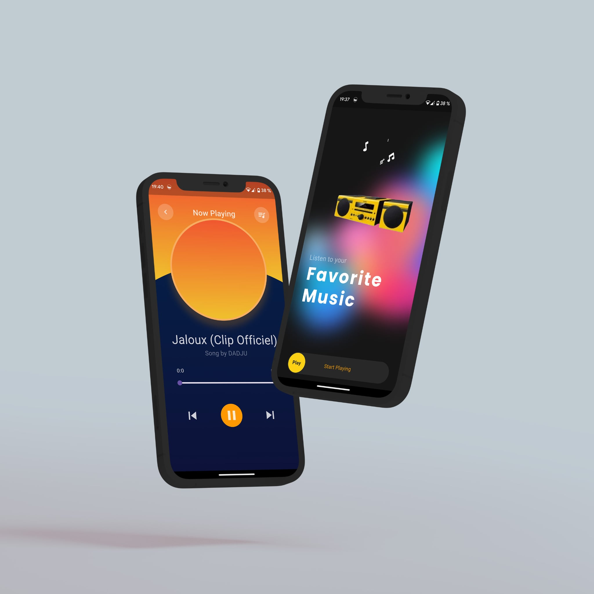

# MuseVibes

**MuseVibes** est une application mobile qui permet de **lire de la musique** et d'**inviter un ami à écouter sa playlist sur un autre appareil** grâce à la **synchronisation** des morceaux.

---

## ✨ Présentation

MuseVibes permet aux utilisateurs de partager leurs playlists avec des amis et d'écouter de la musique en synchronisation, sur plusieurs appareils à la fois. Une expérience collaborative pour profiter de la musique ensemble, peu importe où vous êtes.

---

## 📌 Fonctionnalités principales

### 🎶 Lecture de musique
- Écoute de vos morceaux préférés depuis votre appareil.

### 🤝 Invitation et synchronisation
- Invitez un ami à écouter votre playlist en temps réel sur son appareil.
- Synchronisation automatique des morceaux pour une écoute partagée.

---